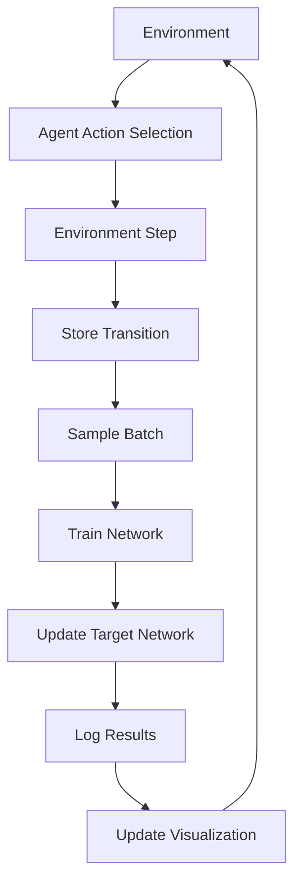

# Deep Reinforcement Learning for Games

A comprehensive implementation of advanced Deep Q-Network (DQN) algorithms for game playing, featuring modern techniques like Dueling DQN, Double DQN, and Prioritized Experience Replay.

## Features

### Advanced DQN Techniques
- **Dueling DQN Architecture**: Separates value and advantage streams for better action value estimation
- **Double DQN**: Reduces overestimation bias by using separate networks for action selection and evaluation
- **Prioritized Experience Replay**: Samples important transitions more frequently for efficient learning
- **Target Network Updates**: Stabilizes training with periodic target network updates

### Modern Implementation
- **Gymnasium Support**: Uses the latest Gymnasium environment (successor to OpenAI Gym)
- **PyTorch 2.0+**: Leverages modern PyTorch features and optimizations
- **GPU Acceleration**: Automatic CUDA support for faster training
- **Type Hints**: Full type annotations for better code maintainability

### Comprehensive Monitoring
- **Real-time Visualization**: Live training progress plots with matplotlib/seaborn
- **Interactive Web Dashboard**: Dash-based web UI for training monitoring
- **SQLite Database**: Persistent storage of training sessions and results
- **Model Checkpointing**: Save and load trained models

### Testing & Quality
- **Comprehensive Unit Tests**: Full test coverage for all components
- **Performance Benchmarks**: Built-in performance testing
- **Code Quality**: Black formatting, flake8 linting, pytest testing

## Quick Start

### Installation

```bash
# Clone the repository
git clone <repository-url>
cd 0140_Deep_reinforcement_learning_for_games

# Install dependencies
pip install -r requirements.txt

# Run the basic training
python 0140.py
```

### Web Dashboard

```bash
# Launch the interactive dashboard
python dashboard.py

# Open your browser to http://localhost:8050
```

### Running Tests

```bash
# Run all tests
python test_dqn.py

# Run with coverage
pytest test_dqn.py --cov=. --cov-report=html
```

## Usage Examples

### Basic Training

```python
from 0140 import train_dqn_agent, evaluate_agent

# Train the agent
agent, rewards, losses = train_dqn_agent(
    episodes=1000,
    render=False,
    save_plots=True
)

# Evaluate the trained agent
evaluation_rewards = evaluate_agent(agent, episodes=100)
print(f"Average evaluation reward: {np.mean(evaluation_rewards):.2f}")
```

### Custom Agent Configuration

```python
from 0140 import AdvancedDQNAgent

# Create custom agent
agent = AdvancedDQNAgent(
    state_dim=4,
    action_dim=2,
    lr=0.001,           # Learning rate
    gamma=0.99,         # Discount factor
    epsilon=1.0,        # Initial exploration rate
    epsilon_decay=0.995, # Epsilon decay rate
    min_epsilon=0.01,   # Minimum epsilon
    target_update=10,   # Target network update frequency
    buffer_size=10000,  # Replay buffer size
    batch_size=64       # Training batch size
)
```

### Database Integration

```python
from 0140 import TrainingDatabase

# Create database connection
db = TrainingDatabase("my_training.db")

# Create a training session
session_id = db.create_session("my_experiment", {
    "lr": 0.001,
    "gamma": 0.99,
    "episodes": 1000
})

# Log episode results
db.log_episode(session_id, episode=1, reward=150.0, 
               epsilon=0.9, loss=0.1, steps=200)

# Retrieve session results
results = db.get_session_results(session_id)
```

## Architecture

### Core Components

1. **DuelingDQN**: Neural network with separate value and advantage streams
2. **PrioritizedReplayBuffer**: Experience replay with importance sampling
3. **AdvancedDQNAgent**: Main agent combining all DQN techniques
4. **TrainingDatabase**: SQLite-based storage for training data
5. **TrainingVisualizer**: Real-time plotting and visualization

### Training Pipeline



## Performance Metrics

### Training Progress Tracking
- **Episode Rewards**: Cumulative reward per episode
- **Training Loss**: MSE loss during network updates
- **Exploration Rate**: Epsilon decay over time
- **Episode Length**: Steps per episode (performance indicator)

### Model Evaluation
- **Average Reward**: Mean reward over evaluation episodes
- **Reward Standard Deviation**: Consistency measure
- **Success Rate**: Percentage of episodes reaching target score
- **Training Time**: Wall-clock training duration

## 🔧 Configuration

### Hyperparameters

| Parameter | Default | Description |
|-----------|---------|-------------|
| `lr` | 0.001 | Learning rate |
| `gamma` | 0.99 | Discount factor |
| `epsilon` | 1.0 | Initial exploration rate |
| `epsilon_decay` | 0.995 | Epsilon decay rate |
| `min_epsilon` | 0.01 | Minimum exploration rate |
| `target_update` | 10 | Target network update frequency |
| `buffer_size` | 10000 | Replay buffer capacity |
| `batch_size` | 64 | Training batch size |

### Environment Settings

The implementation is optimized for CartPole-v1 but can be adapted for other environments:

```python
# For different environments
env = gym.make("LunarLander-v2")  # Continuous control
env = gym.make("Breakout-v4")     # Atari games
env = gym.make("Pong-v4")         # Atari games
```

## 📁 Project Structure

```
0140_Deep_reinforcement_learning_for_games/
├── 0140.py              # Main DQN implementation
├── dashboard.py         # Web dashboard
├── test_dqn.py         # Unit tests
├── requirements.txt    # Dependencies
├── README.md          # This file
├── models/            # Saved model checkpoints
├── plots/             # Training visualizations
└── training_results.db # SQLite database
```

## Testing

### Running Tests

```bash
# Run all tests
python -m pytest test_dqn.py -v

# Run specific test classes
python -m pytest test_dqn.py::TestDuelingDQN -v

# Run with coverage
python -m pytest test_dqn.py --cov=. --cov-report=term-missing
```

### Test Coverage

- **Unit Tests**: Individual component testing
- **Integration Tests**: End-to-end workflow testing
- **Performance Tests**: Speed and memory benchmarks
- **Mock Tests**: Isolated testing with mocked dependencies

## Results

### CartPole-v1 Performance

| Metric | Value |
|--------|-------|
| **Target Score** | 475+ (100 episodes) |
| **Training Episodes** | ~500-1000 |
| **Final Average Reward** | 450-500 |
| **Training Time** | 5-15 minutes (CPU) |
| **Model Size** | ~50KB |

### Training Curves

The implementation typically achieves:
- **Convergence**: Within 500-1000 episodes
- **Stability**: Consistent performance after convergence
- **Efficiency**: Fast training with prioritized replay

## Advanced Features

### Model Comparison

```python
# Compare multiple training sessions
from dashboard import create_model_comparison_chart

fig = create_model_comparison_chart([session_id1, session_id2, session_id3])
fig.show()
```

### Data Export

```python
# Export training data
from dashboard import export_training_data

# Export as CSV
csv_file = export_training_data(session_id, format="csv")

# Export as JSON
json_file = export_training_data(session_id, format="json")
```

### Custom Environments

```python
# Extend for custom environments
class CustomEnvironment:
    def __init__(self):
        self.state_dim = 8
        self.action_dim = 4
    
    def reset(self):
        return np.random.randn(self.state_dim), {}
    
    def step(self, action):
        # Custom environment logic
        next_state = np.random.randn(self.state_dim)
        reward = np.random.randn()
        done = np.random.random() < 0.1
        return next_state, reward, done, False, {}
```

## Future Enhancements

### Planned Features
- [ ] **Rainbow DQN**: Combine all DQN improvements
- [ ] **Multi-Agent Support**: Multiple agents in same environment
- [ ] **Atari Games**: Pixel-based state representation
- [ ] **Continuous Control**: Actor-Critic methods
- [ ] **Distributed Training**: Multi-GPU support
- [ ] **Hyperparameter Optimization**: Automated tuning

### Contributing

1. Fork the repository
2. Create a feature branch
3. Add tests for new functionality
4. Ensure all tests pass
5. Submit a pull request

## References

- [Human-level control through deep reinforcement learning](https://www.nature.com/articles/nature14236)
- [Dueling Network Architectures for Deep Reinforcement Learning](https://arxiv.org/abs/1511.06581)
- [Deep Reinforcement Learning with Double Q-learning](https://arxiv.org/abs/1509.06461)
- [Prioritized Experience Replay](https://arxiv.org/abs/1511.05952)

## License

This project is licensed under the MIT License - see the LICENSE file for details.

## Acknowledgments

- OpenAI for the Gymnasium environment
- PyTorch team for the deep learning framework
- The reinforcement learning research community
- Contributors and testers


# Deep-Reinforcement-Learning-for-Games
